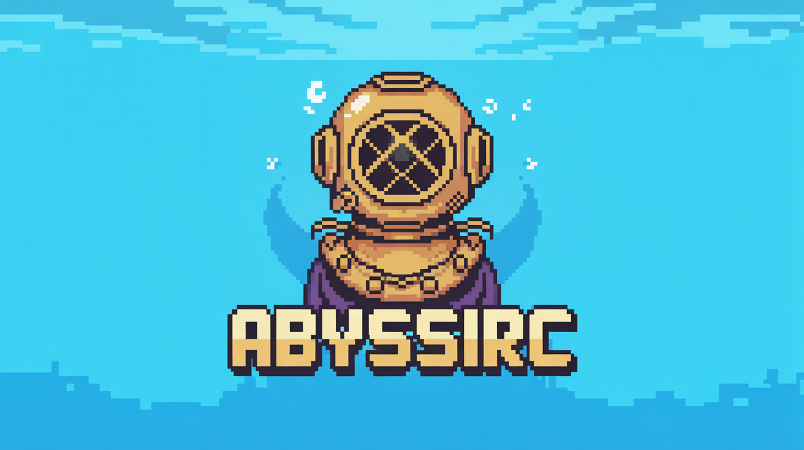

# AbyssIRC Server



AbyssIRC is a modern and lightweight IRC server developed in C#, designed to provide a robust implementation of the IRC
protocol with additional features.

> **IRC is not dead!** This project aims to revitalize IRC by combining the classic protocol with modern features and
> extensibility. Looking for contributors who can help extend the server and build bridges to other chat systems through
> plugins and gateways.

## Milestone Progress

### 🚢 Milestone 0.5.0 "Nautilus" - RELEASED


The first major milestone of AbyssIRC has been completed with the following core IRC features:

- **Connection Management**:
  - Non-SSL and SSL port support
  - Server password authentication

- **Channel Operations**:
  - JOIN command for entering channels
  - Channel topic management
  - Channel permission system
  - User roles (OP status)
  - Channel mode flags (partial implementation)
  - User invitation system
  - Channel listing with topics

- **Moderation Tools**:
  - Ban management in channels
  - KICK command for removing users
  - KILL command for disconnecting users
  - OPER command


- **Communication**:
  - Private messaging between users

- **Server Administration**:
  - RESTART command for operators
  - TIME command for server time reporting

This milestone establishes AbyssIRC as a functional IRC server with the essential features required for basic chat
operations. Future milestones will focus on expanding protocol support, enhancing security features, and adding the
innovative capabilities outlined in our roadmap.

## Features

- Complete implementation of the IRC protocol based on modern standards
- Native SSL/TLS support for secure connections
- Asynchronous event and signal management system
- JavaScript scripting support to extend functionality
- Efficient parsing and serialization of IRC messages
- Simple configuration via YAML files
- Modular system of IRC commands and responses
- Support for variables and templates for MOTD and messages using Scriban templating syntax
- Robust user session and connection management
- Multi-port listening (specify multiple ports with comma separation)

## NuGet Packages

The following packages are available on NuGet.org and GitHub Packages:

### AbyssIrc.Protocol.Messages

[](https://www.nuget.org/packages/AbyssIrc.Protocol.Messages/)

Network communication library for AbyssIrc server. Provides IRC command implementations, protocol handling and message
parsing services.

```bash
# Install via .NET CLI
dotnet add package AbyssIrc.Protocol.Messages

# Install via Package Manager
Install-Package AbyssIrc.Protocol.Messages
```

### AbyssIrc.Signals

[](https://www.nuget.org/packages/AbyssIrc.Signals/)

Event system library for AbyssIrc server. Provides publish/subscribe functionality and asynchronous event handling.

```bash
# Install via .NET CLI
dotnet add package AbyssIrc.Signals

# Install via Package Manager
Install-Package AbyssIrc.Signals
```

These packages are compatible with .NET 9.0

## Upcoming Features

- **Hyper-Scalable Architecture**: Server-to-server protocol implementation for distributed networks
- **Blazing Fast Performance**: Optimized for high-throughput messaging with minimal latency
- **AI-Enhanced Moderation**: Optional integration with AI for intelligent spam and abuse detection
- **Unified Chat Gateway**: Bridge IRC to Discord, Matrix, Slack, and other modern chat platforms
- **Rich Media Support**: Inline media sharing with thumbnails and metadata
- **WebSocket Interface**: Modern web client connectivity without traditional IRC bouncers
- **End-to-End Encryption**: Optional channel and private message encryption
- **OAuth Integration**: Modern authentication with major identity providers
- **Webhooks and Integrations API**: Easy integration with external services
- **Full-Text Chat History**: Searchable message history with customizable retention policies

## System Requirements

- .NET 9.0
- Operating System: Windows, Linux, or macOS (arm64 and x64 supported)

## Installation

### Using Docker

The easiest way to run AbyssIRC is with Docker:

```bash
# Pull the latest image
docker pull tgiachi/abyssirc-server

# Run the server (basic)
docker run -p 6667:6667 -p 6697:6697 tgiachi/abyssirc-server

# Run with a persistent configuration directory
docker run -p 6667:6667 -p 6697:6697 \
  -v $(pwd)/abyssirc-data:/app/abyss \
  -e ABYSS_ROOT_DIRECTORY=/app/abyss \
  tgiachi/abyssirc-server
```

### From Source

1. Clone the repository:
   ```
   git clone https://github.com/tgiachi/abyssirc-server.git
   cd abyssirc-server
   ```

2. Build the project:
   ```
   dotnet build --configuration Release
   ```

3. Run the server:
   ```
   dotnet run --project AbyssIrc.Server/AbyssIrc.Server.csproj
   ```

### Using NuGet Packages for Development

If you want to develop applications or extensions that interact with AbyssIrc:

1. Create a new project:
   ```
   dotnet new console -n MyAbyssIrcExtension
   cd MyAbyssIrcExtension
   ```

2. Add the necessary packages:
   ```
   dotnet add package AbyssIrc.Protocol.Messages
   dotnet add package AbyssIrc.Signals
   ```

3. Import and use in your code:

   ```csharp
   using AbyssIrc.Network.Commands;
   using AbyssIrc.Signals.Interfaces.Services;

   // Example: Create and serialize a PING command
   var pingCommand = new PingCommand("irc.example.com", "timestamp123");
   string serialized = pingCommand.Write(); // Will output ":irc.example.com PING :timestamp123"

   // Example: Use the signals system
   public class MySignalListener : IAbyssSignalListener<YourEventType>
   {
       public Task OnEventAsync(YourEventType signalEvent)
       {
           // Handle the event
           return Task.CompletedTask;
       }
   }
   ```

### Configuration

The main configuration file is in YAML format and is automatically created on first run. The main parameters include:

> **Note about MOTD**: The `motd` field can be either a direct string or a file reference using the `file://` prefix relative
> to the root directory. For example, `file://motd.txt` will load the MOTD from a file named `motd.txt` in the server's root
> directory.

```yaml
network:
  host: irc.abyssirc.com
  ports: "6667"        # Multiple ports can be specified with commas, e.g., "6666,6667,7000"
  ssl_ports: "6697"    # Multiple SSL ports can be specified with commas, e.g., "6697,7697"
  ssl_cert_path: ""
  ssl_cert_password: ""
  ping_timeout: 180
  ping_interval: 60

admin:
  server_password: ""
  admin_info1: "AbyssIrc"
  admin_email: "admin@abyssirc.com"
  network_name: "AbyssIRC"

motd:
  motd: "Welcome to AbyssIrc!"  # Can also use file:// prefix to load from a file

limits:
  max_silence: 16
  max_modes: 6
  max_away_length: 200
  case_mapping: "rfc1459"
  max_nick_length: 30
  max_channel_name_length: 50
  max_topic_length: 390
  max_targets: 4
  max_message_length: 512
  max_channels_per_user: 20
  max_bans_per_channel: 50
  user_modes: "iwos"
  channel_modes: "bklmntsiIpK"
  channel_modes_with_param: "bkloI"
  max_chan_join: 25
  status_msg: "@+"
  elist: "MNUCT"

opers:
  users:
    # Example of an operator configuration
    - username: "admin"
      password: "strong_admin_password"
      host: "192.168.1.*"  # IP mask allowing access

    # Another example with a more restrictive mask
    - username: "localadmin"
      password: "another_secure_password"
      host: "127.0.0.1"  # Localhost only

    # Example with domain mask
    - username: "webadmin"
      password: "web_admin_password"
      host: "*.example.com"  # All subdomains of example.com
```

## Startup Options

The server supports several startup options:

```
-r, --root         Root directory for the server
-c, --config       Configuration file (default: config.yml)
-d, --debug        Enable debug logging
-h, --hostname     Hostname for the server
-s, --show-header  Show header (default: true)
```

## Architecture

AbyssIRC is organized into several modules:

- **[AbyssIrc.Core](./src/AbyssIrc.Core/README.md)**: Contains core functionality and interfaces
- **[AbyssIrc.Protocol.Messages](./src/AbyssIrc.Protocol.Messages/README.md)**: Implements the IRC protocol and command
  handling
- **AbyssIrc.Server**: Implements server logic and connection management
- **[AbyssIrc.Signals](./src/AbyssIrc.Signals/README.md)**: Event system and internal messaging

### Event System

The heart of the server is a publish/subscribe event system that allows communication between various components in a
decoupled and asynchronous manner.

### Connection Management

AbyssIRC uses an efficient connection management system with support for standard and SSL/TLS connections. Each connection is
handled asynchronously, allowing the server to manage a large number of clients simultaneously.

### Template Variables and Text Substitution

AbyssIRC supports dynamic text substitution in MOTD and server messages using the Scriban templating engine. You can use
variables such as:

- `{{hostname}}` - Server hostname
- `{{version}}` - Server version
- `{{created}}` - When the server was created
- `{{uptime}}` - Server uptime
- `{{admin_email}}` - Admin email address
- `{{network_name}}` - IRC network name
- `{{os_name}}` - Operating system name
- `{{cpu_count}}` - Number of CPU cores

Custom variables can be defined programmatically. These variables are processed in real-time, so values like `{{uptime}}`
will always show the current uptime.

### Extensibility via JavaScript

A powerful feature of AbyssIRC is the ability to extend server functionality through JavaScript scripts. Scripts can:

- Register new commands
- React to server events
- Schedule tasks
- Modify server behavior
- Add custom template variables
- Implement custom functionality

### JavaScript API Reference

AbyssIRC provides a comprehensive JavaScript API for extending server functionality. The API is accessible through global
objects that provide various capabilities:

#### Logger API

```typescript
declare const logger: {
    // Log an informational message
    info(message: string, args: any[]): void;
    // Log a warning message
    warn(message: string, args: any[]): void;
    // Log an error message
    error(message: string, args: any[]): void;
    // Log a critical message
    critical(message: string, args: any[]): void;
    // Log a debug message
    debug(message: string, args: any[]): void;
};
```

#### Events API

```typescript
declare const events: {
    // Register a callback to be called when the script abyssirc is started
    on_started(action: () => void): void;
    // Hook into an event
    hook_event(event_name: string, event_handler: (arg: any) => void): void;
};
```

#### Scheduler API

```typescript
declare const scheduler: {
    // Schedule a task to be run every x seconds
    schedule_task(name: string, seconds: number, callback: () => void): void;
};
```

#### IRC Manager API

```typescript
declare const irc_manager: {
    // Hook into a command
    hook_command(command_code: string, callback: (arg1: string, arg2: any) => void): void;
    // Get session by id
    get_session(id: string): IIrcSession;
    // Send NOTICE to a session or channel
    send_notice(nickname_or_channel: string, message: string): void;
};
```

#### Template API

```typescript
declare const template: {
    // Add Variable to the text template service and you can find by use {{name}}
    add_variable(name: string, value: any): void;
    // Add Variable Builder to the text template service and you can find by use {{name}}
    add_variable_builder(name: string, builder: () => any): void;
    // Replaces the text with the variables
    translate_text(text: string, context?: any): string;
    // Get all variables
    get_variables(): string[];
};
```

#### IRC Session Interface

```typescript
interface IIrcSession {
    id: string;
    ip_address: string;
    host_name: string;
    virtual_host_name: string;
    port: number;
    nickname: string;
    username: string;
    real_name: string;
    user_mask: string;
    is_valid: boolean;
    is_user_sent: boolean;
    is_nick_sent: boolean;
    is_password_sent: boolean;
    is_registered: boolean;
    is_away: boolean;
    away_message: string;
    last_ping_sent: any;
    last_pong_received: any;
    last_activity: any;
    is_ping_pending: boolean;
    joined_channels: any;
    modes_string: string;
    is_invisible: boolean;
    is_operator: boolean;
    receives_wallops: boolean;
    is_registered_user: boolean;
}
```

#### Constants

```typescript
// The server version
declare const VERSION: string;
```

#### JavaScript Example

```javascript
// Example script that adds a custom greeting and schedules a task
// Save this as scripts/bootstrap.js

// Register event handler for when a client connects
events.hook_event("client_connected_event", (eventData) => {
    logger.info("New client connected: {0}", [eventData.endpoint]);
});

// Schedule a task to run every 60 seconds
scheduler.schedule_task("announce_uptime", 60, () => {
    // Use the session API to get a user by ID
    const session = irc_manager.get_session("some-user-id");
    if (session && session.is_registered) {
        // Send a notice to the user
        irc_manager.send_notice(session.nickname, "Welcome to our server!");
    }
});

// Register a custom command handler
irc_manager.hook_command("PRIVMSG", (sessionId, command) => {
    // Log when private messages are sent
    logger.debug("PRIVMSG from {0}: {1}", [sessionId, command.message]);
});

// Add a custom template variable
template.add_variable("my_cool_var", "Hello from JavaScript!");

// Add a dynamic template variable
template.add_variable_builder("random_quote", () => {
    const quotes = [
        "The best way to predict the future is to invent it.",
        "Programming today is a race between software engineers striving to build bigger and better idiot-proof programs, and the Universe trying to produce bigger and better idiots. So far, the Universe is winning.",
        "The most disastrous thing that you can ever learn is your first programming language."
    ];
    return quotes[Math.floor(Math.random() * quotes.length)];
});

// Log when the server starts
events.on_started(() => {
    logger.info("Server has started. Version: {0}", [VERSION]);
    logger.info("Custom script loaded successfully!");
});
```

You can use the custom variables in your MOTD like this: `Quote of the day: {{random_quote}}` or `{{my_cool_var}}`

## Development

To contribute to the development:

1. Fork the repository
2. Create a branch for your feature (`git checkout -b feature/amazing-feature`)
3. Commit your changes (`git commit -m 'Add amazing feature'`)
4. Push to the branch (`git push origin feature/amazing-feature`)
5. Open a Pull Request

### IRC Command Structure

IRC commands are implemented following a common pattern:

```csharp
public class MyCommand : BaseIrcCommand
{
    public MyCommand() : base("COMMANDCODE") { }

    // Command-specific properties

    public override void Parse(string line)
    {
        // Parse the message
    }

    public override string Write()
    {
        // Serialize the command
    }

    // Factory methods
}
```

## License

This project is licensed under MIT - see the LICENSE file for details.

## Contributing

I'm actively looking for contributors who can help:

- Develop plugins for AbyssIRC
- Create gateways to bridge IRC with other chat systems (Discord, Matrix, Slack, etc.)
- Improve the core server functionality
- Write documentation and examples
- Test the server in different environments

If you're interested in bringing IRC back to life with modern technology, please consider contributing!

## Contact

- GitHub: https://github.com/tgiachi/abyssirc-server
- Open an issue or pull request for questions and contributions


[](https://app.fossa.com/projects/git%2Bgithub.com%2Ftgiachi%2Fabyssirc-server?ref=badge_large&issueType=license)
---

squid -
